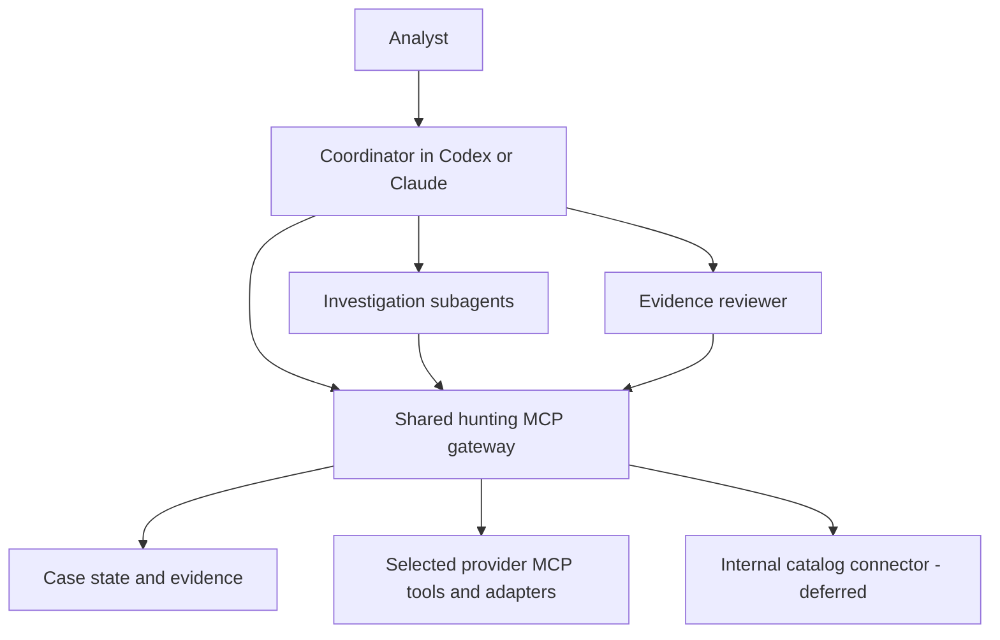

# Threat-hunting harness design

Status: ready for consolidated review. The workflow decisions below are accepted; the proposed implementation defaults and overall design await final confirmation before implementation.

## Intended outcome

Given known malicious domains or IP addresses from one campaign and an investigation time window, help an experienced analyst discover additional candidate infrastructure. Return traceable evidence and hypotheses that the analyst can assess, keeping relatedness, malicious use, and actor attribution distinct.

Report and news ingestion will feed the same workflow later. The user will define internal datalake sources later as specific tables from their catalog.

## Agreed workflow and boundaries

- Use existing observations from intelligence providers and internal datasets. Never contact suspected infrastructure or request a fresh provider scan or fetch on the harness's behalf.
- Include Censys, Shodan, VirusTotal/GTI, and GreyNoise in the external-source scope. Provide the internal connector when the user defines the catalog tables and backend.
- Use a coordinator, investigation subagents, and a separate evidence reviewer, all through a shared hunting MCP gateway.
- Preserve all returned candidate hosts and their provenance before narrowing. Retain the full retrieved set separately from the subset selected for expansion.
- Expand on a distinctive relationship aligned with the campaign's dates, or several independent supporting observations. Shared ASN, hosting provider, or CDN membership alone does not justify expansion.
- Keep historical association separate from evidence of current malicious use, including evidence of infrastructure reassignment.
- Enable no application-level numeric limits by default. Allow the user to specify limits; record usage even when limits are unset.
- Defer the application-level approval workflow. The current draft interprets the user's latest instruction as automatic provider lookups within the hunt scope; this interpretation is included in the overall design to confirm. No approval expiration policy was selected.
- Permit full unclassified internal-source records and context to enter the hosted model.
- Continue with available evidence when sources are unavailable, rate-limited, or inaccessible. Mark source gaps explicitly.
- Store resumable local cases with a Markdown report, structured evidence, query history, any applicable authorization history, and exportable candidate IOCs.
- Let the user ask the coordinator for status while work runs.
- Finish when no new candidates meet the expansion criteria. Pause when remaining work depends on unavailable sources. New inputs or an explicit refresh can resume the saved case.
- Use reusable hunting playbooks while allowing investigators to propose additional strategies. Every expansion must explain its hypothesis and supporting evidence.

## Investigation cycle

1. Establish the case: campaign hypothesis, seeds, time window, available sources, and any user-specified limits.
2. Retrieve existing observations through the gateway and preserve their source, query, timestamps, and raw evidence.
3. Generate candidates using the applicable playbooks.
4. Save the returned candidate set, including candidates that will not be expanded. Record incomplete retrieval and continuation information when applicable.
5. Narrow using the agreed expansion criteria, then investigate the selected candidates. Saved status alone is not verification or a reason to expand.
6. Have the evidence reviewer challenge proposed relationships, stale observations, shared-infrastructure coincidences, and unsupported attribution. Another agent's agreement is not additional source evidence.
7. Present findings and alternative explanations for analyst review while continuing useful branches.
8. Complete or pause according to the natural stopping rule. Preserve the reason and enough state to resume.

Repeated discovery of the same evidence is not new investigative progress. Source unavailability, a successful query returning no matches, and evidence contradicting a hypothesis remain separate outcomes.

## Hunting playbooks

The accepted initial strategy families are:

- Certificate relationships and reuse.
- Historical DNS relationships.
- Hosting and service fingerprints.
- Other infrastructure relationships supported by source observations.

A playbook describes the hypothesis, useful observations, narrowing criteria, expansion rationale, and common alternative explanations. It does not grant access to a provider or permit active collection. A strategy is applicable only when the available source supports the necessary observations.

Investigators can propose additional strategies with an explicit hypothesis and evidence rationale; the same retention, expansion, collection, and stopping rules apply.

## Coordinator and investigation agents

The coordinator maintains the case hypothesis, assigns investigation branches, combines findings, and answers status questions. Investigation agents pursue scoped analytical work. The evidence reviewer assesses the proposed claims rather than treating agreement among agents as corroboration.

All agents share query history, evidence, execution state, and any configured limits through the gateway. Delegation must not duplicate resource allowances or silently create a different collection policy.

Status is grounded in recorded state: current phase and hypothesis, active and queued branches, saved and narrowed candidates, findings awaiting review, completed and failed queries, usage, configured limits, source gaps, and reasons for waiting or stopping. Unknown provider cost is not zero, and an unknown amount of remaining work does not support an invented completion percentage.

## MCP architecture

The shared gateway is accepted. It exposes existing-observation operations, records queries and evidence, provides status, and applies optional limits. Provider integrations sit behind it.

The [provider assessment](research/threat-intelligence-mcp.md) and [client comparison](research/agent-mcp-clients.md) document available options and limitations. Both clients document stdio and remote HTTP MCP support. Installed-client behavior, account entitlements, and hosted tool inventories have not been verified.

| Source | Proposed implementation choice for review |
| --- | --- |
| Censys | Reuse selected existing-observation tools from the official hosted MCP services. Verify actual deployed tool names and schemas before enabling them; exclude scans and operational writes. |
| VirusTotal/GTI | Reuse Google's GTI MCP retrieval/search tools. Exclude file uploads, analysis submissions, and collection writes. |
| Shodan | Build a narrow existing-observation adapter using the official API, adapting reviewed community MCP code only where useful. Preserve history, per-observation timestamps, raw records, and documented pagination. |
| GreyNoise | Reuse its provider-owned MCP retrieval/search tools. Exclude operational writes and webhook tests. |
| Internal datalakes | Define an adapter interface now; implement it when the user supplies the catalog tables, backend, and schema mapping. Do not claim a live internal integration before then. |

MCP tool calls, upstream API requests, returned records, and provider credits are distinct measurements. A hosted tool can make multiple upstream requests. An optional limit can only be promised where the adapter can observe and control the corresponding measure; unavailable accounting must be reported explicitly.

## Proposed implementation defaults for confirmation

These are concrete recommendations for the remaining engineering choices, not decisions already accepted in the interview.

| Area | Proposed default |
| --- | --- |
| Language and packaging | Python 3.11+, with dependencies and run/verification instructions owned by this repository. The workshop mounts this separate repository at projects/threat-hunting-harness/. |
| Local runtime and transport | A long-lived local gateway exposing Streamable HTTP MCP on loopback, used by both clients. Authenticate the local endpoint; keep deployment local initially. |
| Durable state | SQLite for case, job, query, and candidate indexes; source records in case-local JSONL artifacts; Markdown reports and structured JSON/CSV exports. |
| Responsive execution | Record long-running queries as jobs with observable state and result references. Status reads remain available during investigation; resuming does not silently replay completed work. |
| Agent integration | Client-specific skills and native agent definitions share the playbooks and gateway contract. Keep investigative judgment in agent instructions and durable state/query execution in the gateway. |
| Provider selection | Use the source-specific choices in the MCP table above, subject to verified tool behavior and account availability. |
| Credential and collection boundary | Keep provider credentials with the gateway and configure dedicated hunting profiles to prevent alternative provider or direct-target access. Verify the effective client/runtime controls before claiming that this boundary is enforced. |
| Evidence interpretation | Preserve source observation timestamps separately from retrieval time; retain conflicting observations and mark missing dates unknown. Do not treat copied reports as independent evidence or turn a recent lookup into evidence of current malicious use. |
| Recency and exports | Report explicit observation dates and the case time window. If a current-use claim needs an additional freshness window, make it case-specific; do not invent a universal threshold. Exports retain candidate/analyst-review state and historical/current distinctions. |
| Failure handling | Record failed and incomplete queries, preserve completed evidence, and avoid classifying a failed lookup as a negative result. Retry and pagination behavior must be explicit in adapter contracts and visible in query history. |

Provider quotas, client/runtime capacity, and technical transport constraints are external constraints. They are not hidden application-level hunt-budget defaults.

## Verification and evaluation

The accepted evaluation approach uses several documented campaigns, supplying only a subset of known infrastructure as seeds. Measure recovery of withheld infrastructure, analyst acceptance of additional candidates, and time/query cost against a simple enrichment baseline. Every credited discovery must have a traceable evidence path; repeating an input seed is not a discovery.

The proposed implementation checks are:

- Adapter contract tests with recorded or synthetic provider responses, including historical observations, pagination, partial results, and failures.
- Tests that the exposed operations cannot request active scans, uploads, operational writes, or direct target fetches.
- Case replay showing that broad candidate sets survive narrowing and that evidence remains linked to source queries.
- Shared-state tests for deduplication, optional limits, status during active work, completion, pauses, and resume behavior.
- Client integration checks for the effective MCP tool set and collection restrictions.
- Live provider smoke checks after account access is configured, with results distinguished from offline fixture validation.

The concrete benchmark cases and numeric acceptance thresholds will be established from the available evidence and measured baseline. They are not invented or treated as already satisfied. Historical evaluations must distinguish evidence available during the case window from information learned later.

## Explicit deferrals and unverified facts

- Internal catalog table selection, backend, and schema mapping: deferred by the user.
- Report and news ingestion: later input stage, feeding the same investigation workflow.
- Application-level query approval workflow and approval lifetime: deferred.
- Provider credentials, account entitlements, current hosted tool inventories, source history coverage, and exact client interoperability: implementation checks still required.
- Concrete benchmark cases and numeric performance thresholds: validation work still required.
- Infrastructure discoveries and attribution accuracy: not demonstrated by this design or by the MCP research.

## Review status

Workflow decisions through the natural completion rule and playbook approach are accepted. The proposed implementation defaults, provider choices, and the interpretation of deferred approvals as automatic scoped lookups are presented together for final confirmation. Implementation has not started.

Domain terminology is in [CONTEXT.md](../CONTEXT.md). Relevant decisions are [existing observations only](adr/0001-use-existing-observations-only.md), the [deferred batch-approval design](adr/0002-approve-bounded-external-query-batches.md), and the [shared gateway](adr/0003-share-hunt-execution-through-an-mcp-gateway.md).
